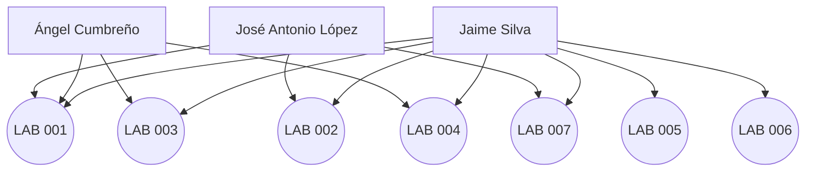

# 📈 Dashboard de Progreso – ATLANTYDE Founders

Este panel muestra el avance de los miembros fundadores a través de los Labs.  
Los datos se actualizarán automáticamente mediante GitHub API en versiones futuras.

---

## 🌊 Visual de Progreso (Prototipo Mermaid.js)

---

## 🔧 Personaliza y amplía tu dashboard

🎨 José Antonio, este bloque Mermaid puede editarse directamente desde GitHub o usando herramientas externas.

- Puedes hacerlo tan visual y detallado como desees.
- Puedes incluso transformarlo a **D3.js, Recharts o Chart.js** si lo prefieres dinámico.

---

## 📚 Learning Paths para ti (Loky)

### 📘 Mermaid.js
- Sitio oficial: [https://mermaid-js.github.io](https://mermaid-js.github.io)
- Guía de diagramas de flujo: [Flowcharts](https://mermaid-js.github.io/mermaid/#/flowchart)

### 📘 D3.js
- Sitio oficial: [https://d3js.org](https://d3js.org)
- Curso práctico (observable): [https://observablehq.com/@d3/learn-d3](https://observablehq.com/@d3/learn-d3)

### 📘 Chart.js (alternativa simple)
- Sitio oficial: [https://www.chartjs.org](https://www.chartjs.org)
- Ejemplos rápidos: [Samples](https://www.chartjs.org/samples/latest/)

---

> 🛠️ Desbloquea nuevas ideas. Visualiza el impacto.  
> Este dashboard es tu lienzo técnico. ¡Hazlo tuyo!
